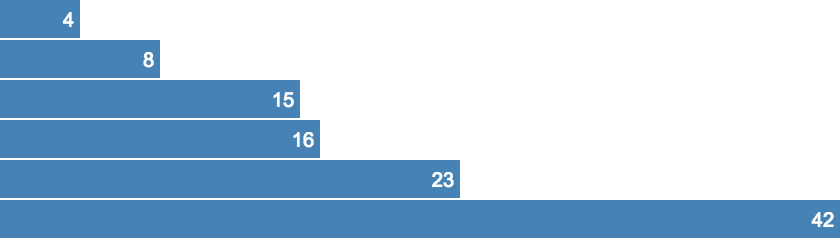

chart-export-example
====================

> An example of using various Node tools to create an SVG / PNG export from a D3 SVG+CSS chart

## Example export

http://bl.ocks.org/mbostock/raw/7341714/ becomes:

## Relevant links

- https://github.com/segmentio/nightmare
- https://www.npmjs.com/package/svg2png
https://www.smashingmagazine.com/2014/05/love-generating-svg-javascript-move-to- -server/
- http://fabricjs.com/
- https://github.com/TooTallNate/node-data-uri-to-buffer
- https://github.com/Automattic/node-canvas
- https://github.com/tmpvar/jsdom
- https://github.com/exupero/saveSvgAsPng

## Last findings

- Client-side: saveSvgAsPng, except IE (https://github.com/Quartz/Chartbuilder/blob/master/src/js/components/ChartExport.jsx)
- Server-side: Electron (Nightmare) + saveSvgAsPng? Client-side code + Nightmare one-liner to trigger generation & retrieve URI
